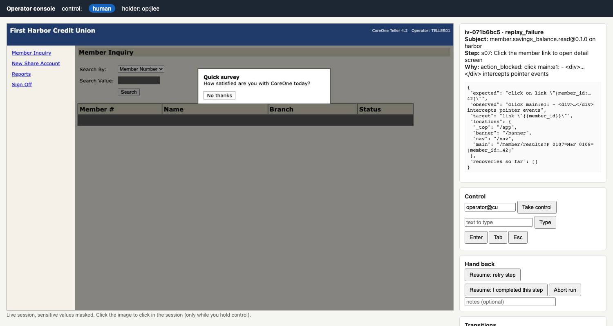

# Computer-Use Automation: discover once, replay deterministically

An LLM works out how to finish a task in a legacy UI that has no API. The successful run is saved as a **typed, versioned capability artifact**, and after that the capability replays **without a model in the loop**. Replay handles runtime errors deliberately, keeps to an allowlist, redacts regulated data, and can hand the **live session** to a human and get it back.

```
goal spec ──► discovery (Claude, observe→decide→act) ──► capability artifact (draft)
                                                            │  cua show / cua approve (hash-bound)
tool call ──► deterministic replay (no LLM) ──► success | business_outcome | failure | rejected
                    │  recoverable conditions handled in place (app profile)
                    └─ stuck / risky ──► intervention ──► operator takes the same session ──► resume
```

The design write-up is in **[REPORT.md](REPORT.md)**. The evidence is in **[evidence/](evidence/README.md)**.

---

## Setup

Requirements: Python ≥ 3.12, [uv](https://docs.astral.sh/uv/). Discovery also needs **either** the Claude Code CLI (`claude`, already logged in) **or** an Anthropic API key. Replay needs neither.

```bash
uv sync
uv run playwright install chromium
cp .env.example .env        # demo credentials for the local mock app (synthetic)
```

`.env` contains the following:

| variable | purpose |
|---|---|
| `HARBOR_TELLER_USER` / `HARBOR_TELLER_PASSWORD` (and `PINERIDGE_…`) | Login for the mock app. Values come from `.env.example`, and they are synthetic. The model never sees them. They are injected when an action runs. |
| `CUA_LLM` | `claude-cli` (default: shells out to `claude -p` and uses your local Claude Code login) or `anthropic` |
| `ANTHROPIC_API_KEY` | Only needed with `CUA_LLM=anthropic` (then `uv sync --extra anthropic`) |

The target app is **CoreOne Teller**, a deliberately hostile legacy core-banking mock in `src/mockbank/`. It starts **automatically in-process** on `127.0.0.1:8801` when no server is listening there, so you don't need to start anything yourself. To run it on its own, use `uv run cua mock`.

## Demo path

### 1. Discovery (real LLM run)

```bash
uv run cua discover goals/savings_balance.yaml            # add --headed to watch it
```

The agent signs on, finds member 10042, and reads the Share Savings balance and the member's name. It then writes `capabilities/member.savings_balance.read/<version>.json` as a **draft**. The run's evidence goes to `runs/<run-id>/` (curated runs live in `evidence/runs/`).

### 2. Review and approve

```bash
uv run cua show member.savings_balance.read               # contract, steps, locator strategies, tool schema
uv run cua approve member.savings_balance.read --reviewer you
```

Approval is bound to the artifact's content hash. If anyone edits the file afterwards, unattended replay refuses to run it.

### 3. Deterministic replay (no LLM)

```bash
uv run cua replay member.savings_balance.read -t harbor -i member_id=10042        # success + typed outputs
uv run cua replay member.savings_balance.read -t harbor -i member_id=99999        # business_outcome RECORD_NOT_FOUND
uv run cua replay member.savings_balance.read -t harbor -i member_id=12ab         # rejected: invalid_input (UI never touched)
uv run cua replay member.savings_balance.read -t harbor -i member_id=10042 --inject expire_after=1   # recovers: re-auth
uv run cua replay member.savings_balance.read -t harbor -i member_id=10042 --inject error_500_on=/member/detail  # failure: app_error
uv run cua replay member.savings_balance.read -t pineridge -i member_id=10042     # other tenant, vendor 4.3, via overlay
```

stdout carries the result contract, which is the caller's channel. The run directory holds the redacted log, a redacted `result.json`, and masked screenshots.

Injectable faults: `interstitial=true`, `expire_after=N`, `slow_ms=N`, `transient_503=N`, `error_500_on=<path>`, `deny_detail=true`, `hold_dialog=true`, `survey_modal=true`.

### 4. Human handoff on the live session

```bash
uv run cua replay member.savings_balance.read -t harbor -i member_id=10042 \
    --inject survey_modal=true --on-failure escalate --headed
```

An unknown popup blocks the click. The replay pauses and raises an intervention, which is written to `interventions/` and printed with the console URL. Open **http://127.0.0.1:8802/** and do three things:

1. Click **Take control**.
2. Click "No thanks" on the live screenshot. You can also use the headed browser window directly.
3. Click **Resume: retry step**.

The replay then continues on the same session. Your click is recorded as `button "No thanks"`.



To do the same thing without clicking yourself, run the scripted operator in a second terminal:

```bash
uv run python scripts/operator_bot.py --claim --click 562,190 --release retry --notes "closed popup"
```

Irreversible steps work the same way. `member.share.open` stops before **Confirm & Open** unless the caller passes `--irreversible authorized`; with `--irreversible escalate` it asks a human approver at that step instead.

### Running without live services

Replay, tests and evidence regeneration need **no LLM and no network**. The mock runs locally and the approved artifacts are committed:

```bash
make test        # 43 tests: unit + LLM adapters + real-browser integration + fake-model discovery + handoff
make evidence    # re-runs all 18 replay scenarios into evidence/runs + evidence/REPLAYS.md
```

Only `cua discover` needs a model.

## Repository layout

```
src/cua/
  schema.py        capability artifact (contract, steps, locator strategies, checkpoints, overlays)
  agent.py         discovery loop (observe → decide → act), stuck detection, approval gate
  recorder.py      trace → artifact (unique strategies only, parameterization, checkpoints, lint)
  replay.py        deterministic executor, condition detection, recovery, result contract
  policy.py        allowlist gate + irreversibility classification + network route guard
  handoff.py       control channel (who holds the session), interventions, operator console
  redact.py        known-value + pattern redaction; evidence.py: redacted JSONL + masked screenshots
  surface/         the perceive/act seam: base.py (protocol), web.py (Playwright), perception.js
  store.py         capabilities/<id>/<semver>.json, overlays, approval
config/            apps/coreone-teller.yaml (vendor profile: runtime conditions), tenants/, policy.yaml
goals/             goal specs (human-authored contracts handed to discovery)
capabilities/      approved artifacts + a vendor-version overlay
evidence/          discovery + replay runs, REPLAYS.md index, STABILITY.md
scripts/           make_evidence.py, stability.py, operator_bot.py
src/mockbank/      the proxy target (frameset, table layout, no ids, 2 tenants, fault injection)
```
